# Analysis Workflow — Domain Model and Use-Case Realizations

## Computerized Maintenance Management System (CMMS)

**Document Version:** 2.1.0
**Phase:** Elaboration
**Discipline:** Analysis (Unified Process)
**Source of truth:** CMMS Software Requirements Specification (SRS) v1.1.0
**Date:** 2026-06-09
**Status:** Draft

> **Scope note.** This document covers the Analysis discipline only: the conceptual domain model and the analysis-level realizations (sequence diagrams) of the use cases defined in the SRS. It deliberately excludes Boundary–Control–Entity (BCE) analysis classes and the entire Design workflow (no design classes, no architecture, no infrastructure, no persistence mapping). Where a concern is properly resolved during Design, this is stated explicitly rather than modelled here.

---

## Table of Contents

1. [Purpose and Method](#1-purpose-and-method)
2. [Design Principles and Patterns Applied](#2-design-principles-and-patterns-applied)
3. [Domain Class Model](#3-domain-class-model)
4. [Entity Catalog](#4-entity-catalog)
5. [Use-Case Realizations (Analysis Sequence Diagrams)](#5-use-case-realizations-analysis-sequence-diagrams)
6. [SOLID Compliance Analysis](#6-solid-compliance-analysis)
7. [Requirements Verification](#7-requirements-verification)
8. [Revision History](#8-revision-history)

---

## 1. Purpose and Method

The purpose of this document is to transform the requirements expressed in the SRS into a coherent, extensible conceptual model of the problem domain, and to demonstrate — through use-case realizations — that the identified domain concepts collaborate correctly to satisfy every functional requirement.

The model is produced under a strict extensibility mandate derived from the SRS: the system must accommodate **new categories of users** (both employees and clients), **additional authentication mechanisms**, **additional notification delivery channels**, **additional resolution outcome categories**, and **new functional areas** beyond the consultation of services and incidents — all without modifying existing, working code. Every structural decision below is justified primarily by this mandate and by the SOLID principles.

Two artefact types are produced:

- A single, complete **Domain Class Model** (Section 3) capturing all persistent concepts, the abstractions that make the system extensible, and the structural relationships between them.
- A set of **analysis sequence diagrams** (Section 5), one per SRS use case, showing how domain objects collaborate. These diagrams contain no user-interface (boundary) objects and no use-case controller objects; the participating objects are the actor and the domain concepts themselves, together with the mechanism objects that constitute the applied patterns (event publisher, notification dispatcher, audit logger, delivery channels).

---

## 2. Design Principles and Patterns Applied

### 2.1 Pattern Summary

| Concern | Pattern | Rationale |
|---|---|---|
| Extensible user types | **Generalization / Inheritance** (`User` → `Employee`, `Client`) | New user categories are added as subtypes; existing code that depends on `User` is unaffected. |
| Maintainable, configurable permissions | **Role-Based Access Control (RBAC)** | Capabilities are data (`Role` aggregates `Permission`), not hard-coded type checks. Changing who may perform an action is a single data change. |
| Multiple authentication mechanisms | **Strategy** (`AuthenticationMethod` hierarchy) + extensible `SecondFactor` | Each authentication form is an interchangeable abstraction; new forms (OAuth2, AD, TOTP, future) are new subtypes. |
| Triggering of notifications and audit | **Observer / Publish–Subscribe** (`DomainEvent`, `DomainEventPublisher`, `DomainEventObserver`) | Domain entities raise abstract events and remain ignorant of who reacts. New reactions are new observers. |
| Notification delivery | **Strategy** (`NotificationChannel` hierarchy) | In-app, email, push, and future channels are interchangeable delivery strategies. |
| Audit trail | **Observer + immutable Audit Log** (`AuditLogger`, `AuditLogEntry`) | Audit capture is decoupled from the audited operation; entries are append-only records of state transitions. |
| Shared work-item structure | **Generalization** (`MaintenanceActivity` → `Service`, `Incident`) | Shared identity, ownership, and client association are defined once; new work types extend the base. |
| Files attached to any activity | **Generalization** (`FileAsset` associated with `ManagementActivity`) | Moving the file-attachment point to the base class enables both `Service` and `Incident` to carry files at any lifecycle stage without duplicating the association. |
| Operational status lifecycle | **State Machine via immutable records** (`ActivityStatusTransition` sequence on `MaintenanceActivity`) | Each status change is an immutable, ordered record; the full history is preserved and queryable. Operational state (what is happening) is tracked separately from closure outcome (what the result was, captured in `Resolution`). |
| Physical asset tracking | **Entity** (`Asset` aggregating maintenance history) | Physical assets are first-class domain entities; Services and Incidents optionally reference them to form a queryable per-asset maintenance and fault history. |
| Shared resolution structure | **Generalization** (`Resolution` → `ServiceResolution`, `IncidentResolution`) | The SRS states both resolutions share the same arguments. |
| Shared request structure | **Generalization** (`Request` → `AppointmentRequest`, `AccountRecoveryRequest`) | A uniform "submitted, reviewed, status-bearing" abstraction; new request-driven features extend it. |
| Shared security-token structure | **Generalization** (`SecurityToken` → invitation, reset, refresh) | Time-limited, hashed, single-use tokens share lifecycle attributes. |

### 2.2 Two Decisions That Simplify the Model

**Provenance through audit, not through duplicate associations.** The SRS allows an incident to be reported by a client or, on the client's behalf, by an employee, and allows an account-recovery request to be approved by an administrator. Rather than introduce a second, easily confused "reporter" or "approver" association alongside the natural "subject client" / "requester" association, the identity of the acting party is captured by the audit mechanism (the actor of the corresponding `AuditLogEntry`). This removes ambiguous parallel associations and reuses a mechanism the system already requires.

**Cross-cutting concerns are never embedded in domain entities.** A `Service` or `Incident` raises a `DomainEvent`; it does not create notifications or write audit records itself. This keeps each domain entity responsible for its own state only, and lets notification and audit evolve independently.

---

## 3. Domain Class Model

The following diagram is the complete conceptual domain model. Associations are drawn as plain lines carrying only multiplicities; arrowed connectors are reserved for generalization, realization, composition, and aggregation.

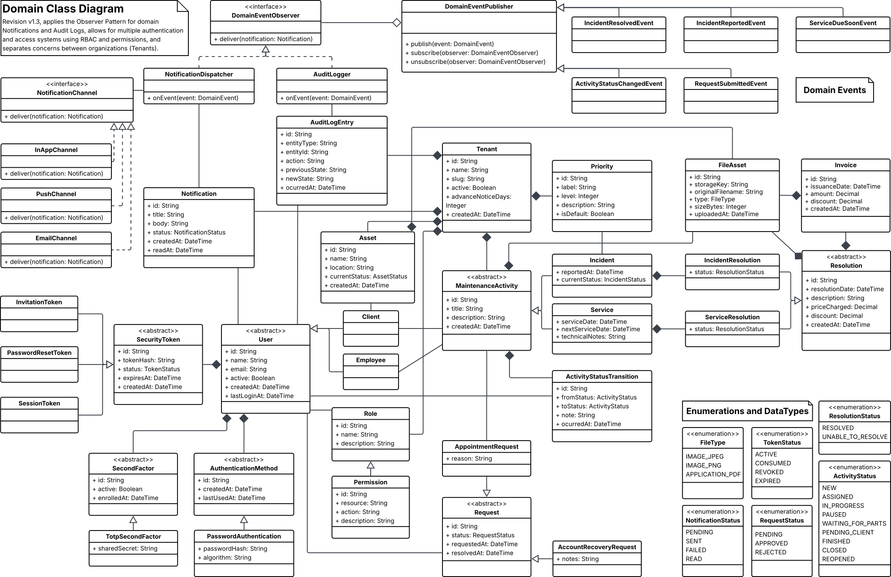

---

## 4. Entity Catalog

Because associations carry no names, the semantics of each relationship are documented here.

### Tenancy

**Tenant** — The aggregate root of the domain. Every user, maintenance activity, priority, role, notification, and audit entry belongs to exactly one tenant and exists only within it (composition). Holds the tenant-level configuration `advanceNoticeDays`, which governs how far in advance a service due-date notification is raised.

### Identity and Access

**User** *(abstract)* — Holds the identity attributes common to every human actor: name, email, active flag, and timestamps. It deliberately contains **no credential data**; how a user proves identity is delegated to `AuthenticationMethod`. A user holds one or more `Role`s (association) and is the recipient of notifications and the actor of audit entries.

**Employee** — A user who carries out work: performs resolutions and is the addressee of internal notifications. The roles an employee may hold (e.g., administrator, technician) are determined entirely by RBAC, not by further subclassing. New employee categories are added as data (new roles) or, if structurally distinct, as new subtypes of `Employee`.

**Client** — A user on whose behalf maintenance activities exist and who submits requests. The "subject" association `Client — MaintenanceActivity` identifies the client a service or incident concerns. New client tiers are added as new roles or subtypes without affecting existing code.

**Role** — A tenant-scoped, named bundle of permissions. Roles are configuration, not code; adding, removing, or re-scoping a role is a data operation.

**Permission** — A fine-grained capability expressed as a `resource` + `action` pair (for example, `invoice` + `read`). Authorization is decided by testing for the presence of a permission, never by testing a user's type. Changing which roles may read invoices is therefore a single change to the role–permission data.

### Authentication

**AuthenticationMethod** *(abstract)* — A strategy representing one way a user proves identity. A user composes one or more methods. Adding a new authentication form is the addition of a subtype and requires no change to `User` or to existing methods.

**PasswordAuthentication / OAuth2Authentication / ActiveDirectoryAuthentication** — Concrete authentication strategies holding only the data each form needs (a password hash; an external provider and subject identifier; a directory domain and distinguished name, respectively).

**SecondFactor** *(abstract)* and **TotpSecondFactor** — An optional, independently extensible second authentication factor. TOTP is the first concrete factor; additional factor types are future subtypes.

### Security Tokens

**SecurityToken** *(abstract)* — A time-limited, hashed, single-use credential with a lifecycle status. Concrete subtypes share this structure: **InvitationToken** (client onboarding), **PasswordResetToken** (credential reset), and **RefreshToken** (session continuation). New token-driven flows extend the base.

### Maintenance

**MaintenanceActivity** *(abstract)* — The base for any tracked unit of maintenance work. Owns the shared identity (title, description, creation time), the tenant ownership (composition from `Tenant`), and the subject-client association. It directly composes zero or more `FileAsset` instances (files or images attached at any lifecycle stage), independently of any files attached within a `Resolution`. It also aggregates an ordered sequence of `ActivityStatusTransition` records and may optionally reference one `Asset`. New work types (for example, inspections) extend this base and immediately inherit all of these capabilities.

**ActivityStatusTransition** — An immutable record of a single operational-status change on a `MaintenanceActivity`. Each record captures: the new status value, the timestamp of the transition, the identity of the acting employee, and optional explanatory notes. The ordered sequence of transitions for an activity forms its complete status lifecycle history. Status values are configurable; the initial set for `Service` is SCHEDULED → IN_PROGRESS → AWAITING_PARTS → COMPLETED / CANCELLED, and for `Incident` is OPEN → IN_PROGRESS → AWAITING_PARTS → CLOSED. The *CLOSED* / *COMPLETED* terminal statuses are applied automatically when a `Resolution` is recorded. `ActivityStatusTransition` captures operational state (what is happening at a given moment) and is deliberately separate from `Resolution`, which captures the formal closure outcome.

**Service** — Planned/preventive maintenance. Adds the actual service date, the next scheduled service date, and a free-text technical-notes field. Optionally composes one `ServiceResolution`. Inherits `FileAsset` composition and `ActivityStatusTransition` history from `MaintenanceActivity`.

**Incident** — Reactive/corrective maintenance reported against a client. Adds the report timestamp and references a `Priority`. Optionally composes one `IncidentResolution`. Inherits `FileAsset` composition (which supersedes the former direct `Incident → FileAsset` association) and `ActivityStatusTransition` history from `MaintenanceActivity`.

**Asset** — A tenant-scoped entity representing a physical item, piece of equipment, or installation. It is associated with a specific `Client` within the tenant and may be optionally referenced by both `Service` and `Incident` records. Its primary purpose is to serve as the aggregation point for querying the complete maintenance and fault history of a specific physical item. Adding an asset-reference to a new work type requires only a new optional reference to `Asset`; no change to `Asset` itself is needed.

**Priority** — A tenant-configurable priority level (label, ordering level, default flag). Modelled as an entity rather than a fixed enumeration so that tenants may reconfigure levels and so that future time-based escalation can operate on it.

### Resolution

**Resolution** *(abstract)* — The shared outcome record for any maintenance activity: resolution date, narrative, price charged, optional discount, the performing employee (association), optional evidentiary images (composition of `FileAsset`), and zero or more invoices (composition). Centralising this structure honours the SRS statement that service and incident resolutions share the same arguments.

**ServiceResolution** — The resolution of a service; inherits the shared structure unchanged.

**IncidentResolution** — The resolution of an incident; adds a `status` (`RESOLVED`, `PENDING_PARTS`, `UNABLE_TO_RESOLVE`). The enumeration is the extension point for additional corrective outcomes.

### Requests

**Request** *(abstract)* — A uniform abstraction for an action a user submits and that is subsequently reviewed, carrying a status and request/resolution timestamps. New user-initiated, reviewable features extend this base.

**AppointmentRequest** — A client's request to bring a service forward; references the target `Service`. It never mutates the service; a technician schedules the work by creating a new service.

**AccountRecoveryRequest** — A client's request to regain access, reviewed by an administrator. The approving administrator's identity is recorded by the audit mechanism rather than by a dedicated association.

### Billing and Files

**Invoice** — A formal charge document associated with a resolution; holds issuance date, amount, and discount, and composes exactly one `FileAsset` (its document).

**FileAsset** — A reference to a binary stored externally (the model holds the storage key, never the bytes). Reused in three composition contexts: files attached directly to a `ManagementActivity` at any lifecycle stage (formerly only available on `Incident` at creation; now generalised to the base class covering both `Service` and `Incident`), evidentiary images on a `Resolution`, and the document of an `Invoice`. Each instance belongs to exactly one owner.

### Events, Notification, and Audit

**DomainEvent** *(abstract)* and its subtypes — First-class records of significant domain occurrences. New event types are added without modifying publishers or existing observers.

**DomainEventPublisher** *(Subject)* — Accepts published events and forwards them to all registered observers. It depends only on the `DomainEventObserver` abstraction.

**DomainEventObserver** *(interface)* — The single-method abstraction every reaction implements.

**NotificationDispatcher** *(observer)* — On receiving an event, creates the appropriate `Notification`(s) and delivers them through one or more `NotificationChannel` strategies.

**Notification** — A message addressed to a recipient user, carrying a delivery/read status.

**NotificationChannel** *(interface)* with **InAppChannel / EmailChannel / PushChannel** — Interchangeable delivery strategies. In-app is the baseline; additional channels are future realizations.

**AuditLogger** *(observer)* — On receiving an event, appends an immutable `AuditLogEntry`. It is the second, fully independent reaction to the same event stream.

**AuditLogEntry** — An append-only record of a state transition: the affected entity type and identifier, the action, the previous and new states, the actor (association to `User`), and the time of occurrence.

**Notification audit** — The `Notification` entity, together with its per-channel delivery-status record, constitutes the notification audit log required by FR-075–FR-077. Each dispatched `Notification` carries the triggering event reference, the recipient, the channel used, and the delivery status. The `NotificationDispatcher` is responsible for persisting this record; the `AuditLogger` captures the corresponding `AuditLogEntry` for domain-event–level traceability. Administrators may query the notification audit log for their tenant (FR-076); the records are immutable and subject to the retention policy (FR-077).

---

## 5. Use-Case Realizations (Analysis Sequence Diagrams)

Each diagram realizes one SRS use case using only the actor and domain objects. The mechanism objects `DomainEventPublisher`, `NotificationDispatcher`, `AuditLogger`, and `NotificationChannel` appear where the Observer and Strategy patterns are exercised.

### UC-001 — Client Reports an Incident

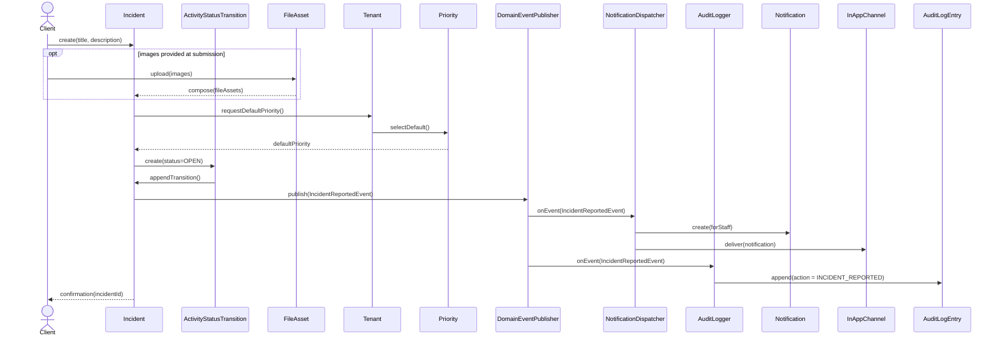

### UC-002 — Technician Resolves an Incident

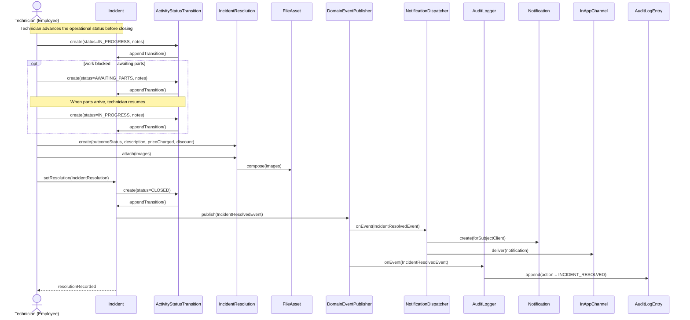

### UC-003 — Technician Creates a Service Record

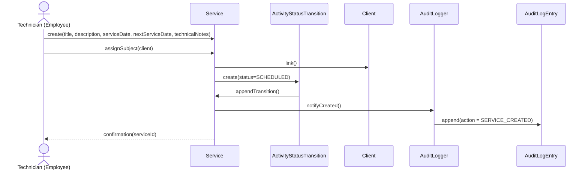

### UC-004 — Technician Completes a Scheduled Service

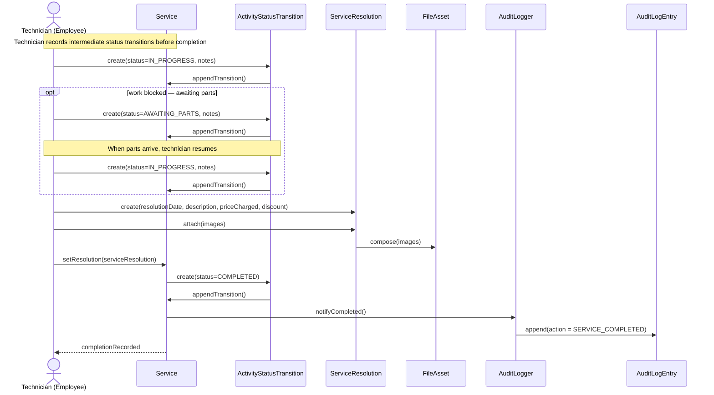

### UC-005 — Client Views Service Calendar

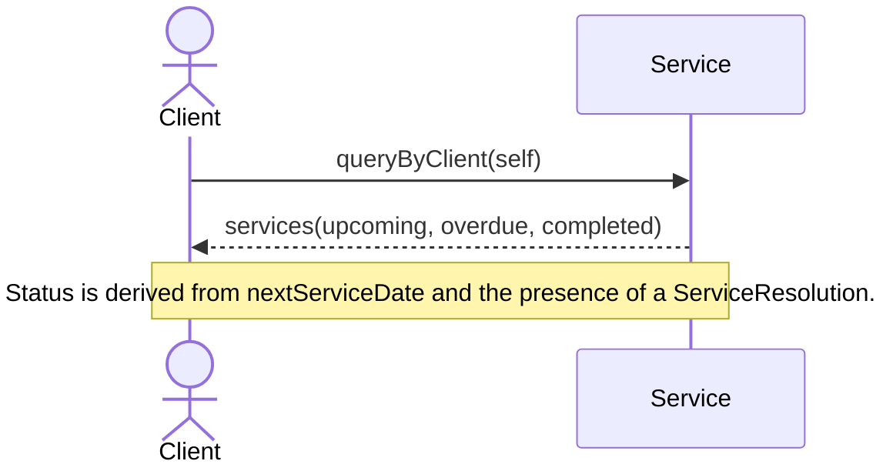

### UC-006 — Employee Views Pending Incidents Dashboard

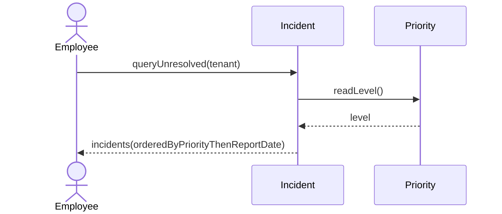

### UC-007 — User Authenticates into the System

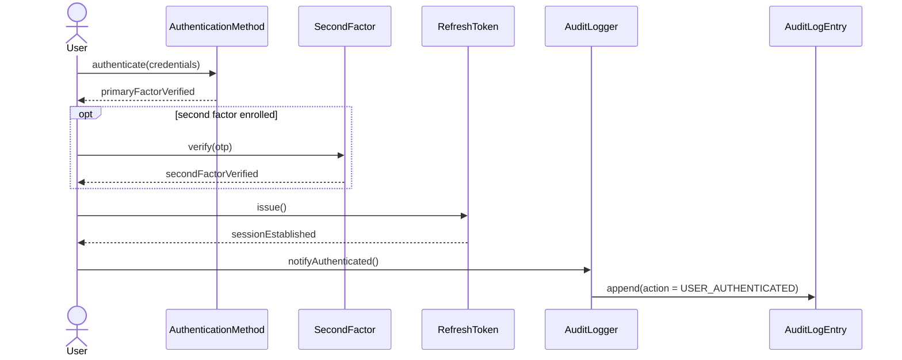

### UC-008 — Administrator Invites a New Client

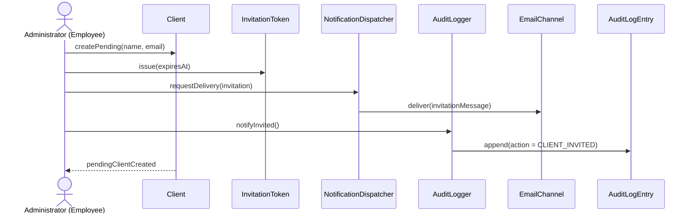

### UC-009 — Client Completes First-Time Registration

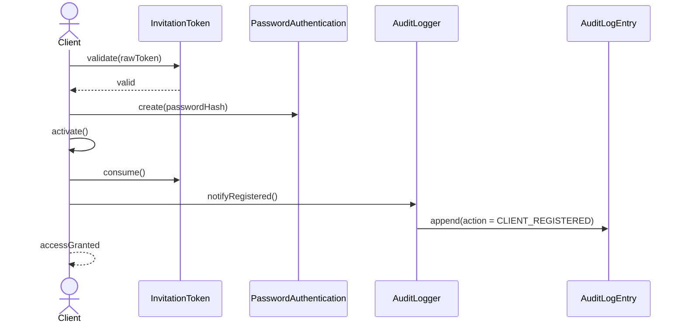

### UC-010 — Client Requests Account Recovery

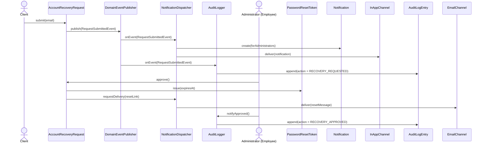

### UC-011 — Administrator Manages User Accounts

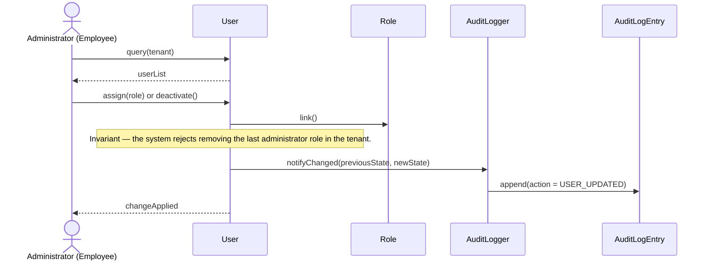

### UC-012 — Employee Adds an Invoice to a Charge

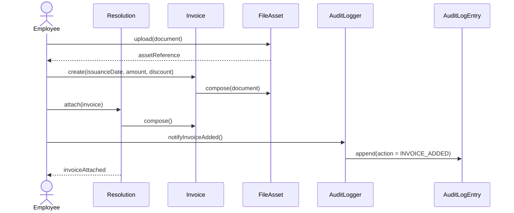

### UC-013 — Client Views Invoices

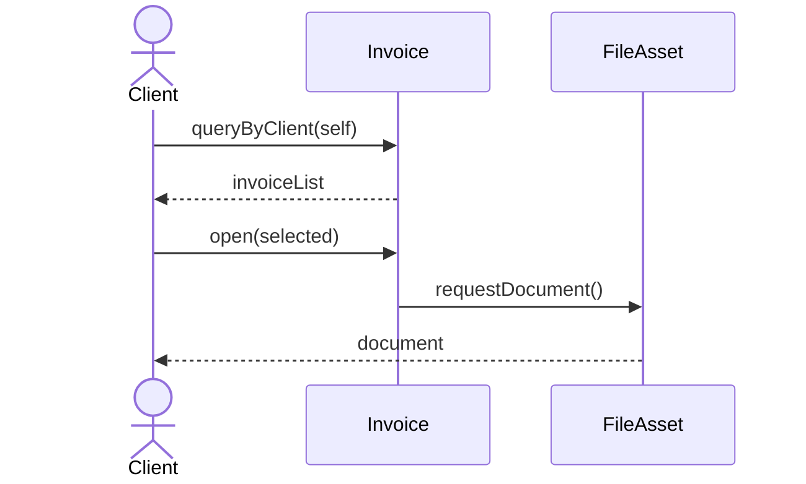

### UC-014 — Administrator Updates Incident Priority

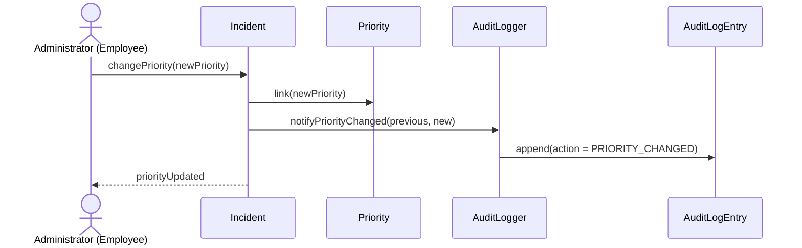

### UC-015 — System Issues a Service Due-Date Notification

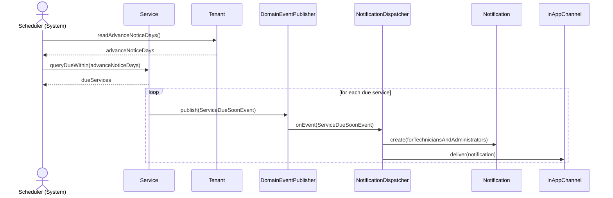

### UC-016 — Client Requests an Early Service Appointment

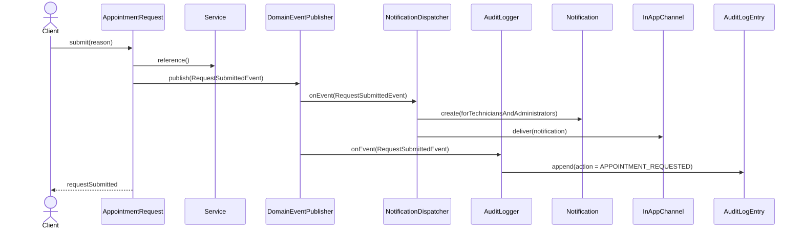

---

## 6. SOLID Compliance Analysis

**Single Responsibility Principle.** Each class has exactly one reason to change. `User` changes only when identity attributes change; credential concerns live in `AuthenticationMethod`. A `Service` or `Incident` manages only its own state and raises an event; it never changes because notification or audit rules change. `NotificationDispatcher` changes only with notification logic, `AuditLogger` only with audit logic, and each `NotificationChannel` only with its own delivery medium.

**Open/Closed Principle.** Every axis of change the SRS anticipates is realized by adding a subtype or a data row, not by editing existing classes: a new user category extends `User`; a new authentication form extends `AuthenticationMethod`; a new second factor extends `SecondFactor`; a new delivery medium realizes `NotificationChannel`; a new reaction realizes `DomainEventObserver`; a new occurrence extends `DomainEvent`; a new reviewable feature extends `Request`; a new work type extends `MaintenanceActivity` and immediately inherits `FileAsset` attachment, `ActivityStatusTransition` tracking, and `Asset` association; a new corrective outcome is a new `ResolutionStatus` value; a new operational status is a new `ActivityStatus` configuration row; new permissions and roles are data.

**Liskov Substitution Principle.** Every subtype is a faithful substitute for its base. `Employee` and `Client` are usable wherever a `User` is expected (as notification recipient or audit actor). `ServiceResolution` and `IncidentResolution` honour the full `Resolution` contract, the latter only adding state. Every concrete `NotificationChannel` fulfils `deliver` without weakening expectations.

**Interface Segregation Principle.** The behavioural abstractions are minimal. `DomainEventObserver` exposes a single `onEvent`; `NotificationChannel` exposes a single `deliver`. Authorization is expressed through fine-grained `Permission` pairs, so a collaborator depends only on the specific capabilities it needs rather than on a broad role interface.

**Dependency Inversion Principle.** High-level mechanisms depend on abstractions, never on concretions. `DomainEventPublisher` knows only `DomainEventObserver`; it is unaware that notification and audit exist. `NotificationDispatcher` depends on the `NotificationChannel` abstraction, not on email or push. Domain entities depend on the abstract `DomainEvent`, not on any reacting component. This inversion is what makes the cross-cutting concerns independently replaceable and testable.

---

## 7. Requirements Verification

### 7.1 Functional Requirements

| Requirement | Realized by | UC |
|---|---|---|
| FR-001 credential login | `PasswordAuthentication` | UC-007 |
| FR-002 OAuth2 login | `OAuth2Authentication` (Strategy subtype) | UC-007 |
| FR-003 Active Directory login | `ActiveDirectoryAuthentication` | UC-007 |
| FR-004 2FA (TOTP) | `SecondFactor` / `TotpSecondFactor` | UC-007 |
| FR-005 session token | `RefreshToken` | UC-007 |
| FR-006 logout | `RefreshToken.status = REVOKED` | UC-007 |
| FR-007 password policy | enforced on `PasswordAuthentication` creation | UC-009 |
| FR-008 employee password reset | `PasswordResetToken` | UC-010 |
| FR-009 no client self-registration | `Client` created only by `Employee` | UC-008 |
| FR-010 invitation link | `InvitationToken` | UC-008 |
| FR-011 first-time registration | `PasswordAuthentication` creation | UC-009 |
| FR-012 subsequent login | authentication flow | UC-007 |
| FR-013 account recovery | `AccountRecoveryRequest` | UC-010 |
| FR-014 notify admin of recovery | `RequestSubmittedEvent` → `Notification` | UC-010 |
| FR-015 invitation expiry / reissue | `SecurityToken.expiresAt`, `status` | UC-008 |
| FR-016 RBAC | `Role`, `Permission` | UC-011 |
| FR-017 three initial roles | `Role` instances | — |
| FR-018 admin also technician | `Employee` with multiple `Role`s | UC-011 |
| FR-019 promote technician to admin | role assignment | UC-011 |
| FR-020 employee never client | disjoint `Employee` / `Client` subtypes | — |
| FR-021 an administrator always exists | invariant on role removal | UC-011 |
| FR-022 view all users | user query | UC-011 |
| FR-023 modify roles/permissions | role assignment | UC-011 |
| FR-024 / FR-025 deactivate / reactivate | `User.active` | UC-011 |
| FR-026 extensible roles | `Role` as data; `User` hierarchy | — |
| FR-027 technician creates service | `Service`, created by `Employee` | UC-003 |
| FR-028 service fields | `Service` attributes | UC-003 |
| FR-029 service ↔ client | `Client — MaintenanceActivity` | UC-003 |
| FR-030 service resolution | `ServiceResolution` | UC-004 |
| FR-031 service resolution fields | `Resolution` attributes, `FileAsset`, `Invoice` | UC-004 |
| FR-032 client requests early service | `AppointmentRequest` | UC-016 |
| FR-033 edit service | `Service` state operations | UC-003 |
| FR-034 employees view services | service query | UC-006 |
| FR-035 client views own services | client-scoped query | UC-005 |
| FR-036 extensible service outcomes | `Resolution` hierarchy | — |
| FR-037 client reports incident | `Incident` | UC-001 |
| FR-038 employee reports on behalf | creation by `Employee`; actor via audit | UC-001 |
| FR-039 incident fields | `Incident`, `Priority`, `FileAsset` | UC-001 |
| FR-040 default priority | `Priority.isDefault` | UC-001 |
| FR-041 admin updates priority | priority reassignment | UC-014 |
| FR-042 future auto-escalation | `Priority` entity + event stream | UC-015 |
| FR-043 incident resolution | `IncidentResolution` | UC-002 |
| FR-044 resolution fields + status | `IncidentResolution.status`, `Resolution` attrs | UC-002 |
| FR-045 two dates | `Incident.reportedAt`, `Resolution.resolutionDate` | UC-002 |
| FR-046 unresolved has no resolution date | `0..1` `IncidentResolution` | UC-002 |
| FR-047 client views incidents | client-scoped query | UC-005 |
| FR-048 employees view incidents | incident query | UC-006 |
| FR-049 extensible incident outcomes | `ResolutionStatus` enumeration | — |
| FR-050 attach invoices to resolution | `Resolution *-- Invoice` | UC-012 |
| FR-051 PDF or image invoice | `FileAsset.type` | UC-012 |
| FR-052 signed-PDF readiness | `Invoice` / `FileAsset` (signing deferred to Design) | UC-012 |
| FR-053 invoice metadata | `Invoice` attributes | UC-012 |
| FR-054 client views invoices | client-scoped query | UC-013 |
| FR-055 employees view invoices | invoice query | UC-012 |
| FR-056 no cross-client invoice access | tenant + subject-client scoping | UC-013 |
| FR-057–FR-061 calendars | `Service` dates + scoped queries | UC-005 |
| FR-062 monitor due dates | `ServiceDueSoonEvent` | UC-015 |
| FR-063 notify on approaching due date | `Notification` via dispatcher | UC-015 |
| FR-064 prompt to contact client | `Notification` content | UC-015 |
| FR-065 in-app channel baseline | `InAppChannel` | UC-001, UC-015 |
| FR-066 extensible channels | `NotificationChannel` (Strategy) | — |
| FR-067 configurable advance notice | `Tenant.advanceNoticeDays` | UC-015 |
| FR-068 pending incidents by priority | incident query ordering | UC-006 |
| FR-069 secondary sort by report date | incident query ordering | UC-006 |
| FR-070 resolved incidents by date | incident query ordering | UC-006 |
| FR-071 incident list fields | `Incident` / `Resolution` attributes | UC-006 |
| FR-072 filter incidents | query parameters | UC-006 |
| FR-073 file assets on services | `ManagementActivity *-- FileAsset` | UC-004 |
| FR-074 file assets on incidents at any lifecycle point | `ManagementActivity *-- FileAsset` | UC-001, UC-002 |
| FR-075 notification dispatch audit log | `Notification` + delivery-status record | UC-015 |
| FR-076 admin queries notification audit | notification audit query | — |
| FR-077 notification audit retention / immutability | immutable `Notification` record lifecycle | — |
| FR-078 ActivityStatusTransition tracking | `MaintenanceActivity *-- ActivityStatusTransition` | UC-001, UC-002, UC-003, UC-004 |
| FR-079 ActivityStatusTransition fields | `ActivityStatusTransition` attributes | UC-002, UC-004 |
| FR-080 Service operational statuses | `ActivityStatus` values (SCHEDULED … COMPLETED) | UC-003, UC-004 |
| FR-081 Incident operational statuses | `ActivityStatus` values (OPEN … CLOSED) | UC-001, UC-002 |
| FR-082 record new status transition | `ActivityStatusTransition` creation | UC-002, UC-004 |
| FR-083 status history visibility | `ActivityStatusTransition` query | UC-002, UC-004 |
| FR-084 configurable status values | `ActivityStatus` database-driven configuration | — |
| FR-085 create / manage assets | `Asset` | — |
| FR-086 asset record fields | `Asset` attributes | — |
| FR-087 service-to-asset reference | `Service →(optional) Asset` | — |
| FR-088 incident-to-asset reference | `Incident →(optional) Asset` | — |
| FR-089 asset maintenance history | `Asset`-scoped query on `MaintenanceActivity` | — |
| FR-090 client views own assets | client-scoped `Asset` query | — |

All 90 functional requirements are realized by the model.

### 7.2 Non-Functional Requirements

**Addressed structurally by the model.** Multi-tenant isolation (NFR-016) is enforced by making `Tenant` the composition root of every tenant-scoped concept, so every query is naturally tenant-bounded. API-level, role-driven access control (NFR-013) is realized by `Role`/`Permission` and the permission-test discipline. Credential protection (NFR-011) is localised to `PasswordAuthentication.passwordHash`. The extensibility family (NFR-037 through NFR-041) is satisfied by the inheritance, Strategy, and Observer structures described in Section 6; NFR-038 is additionally covered by the configurable `ActivityStatus` values. Audit and traceability (NFR-045) are satisfied by the immutable `AuditLogEntry` stream and by the per-`Notification` delivery-status record; the right-to-erasure expectation (NFR-043) is supported by the composition cascades from `Tenant` and `User`.

**Deferred to the Design and Implementation workflows.** Performance and capacity (NFR-001 through NFR-008), availability and recovery (NFR-024 through NFR-027), maintainability tooling and test coverage (NFR-028 through NFR-032), cross-platform delivery (NFR-033 through NFR-036), and transport/at-rest encryption are realization concerns. The domain model is intentionally agnostic to them and places no obstacle in their path; they are not — and at the analysis level cannot be — discharged here.

### 7.3 Technical Requirements

**Accommodated by the model.** Pluggable identity providers and token lifecycle (TR-012 through TR-018) map directly onto the `AuthenticationMethod`, `SecondFactor`, and `SecurityToken` hierarchies. Multi-tenancy (TR-039 through TR-042) is grounded in the `Tenant` aggregate. Asynchronous, channel-extensible notification (TR-034 through TR-038) is the Observer-plus-Strategy structure of `DomainEventPublisher`, `DomainEventObserver`, and `NotificationChannel`. External binary storage (TR-021, TR-022) is reflected by `FileAsset` holding a storage key rather than bytes.

**Deferred to the Design workflow.** The microservice decomposition, API gateway, container packaging and orchestration, database-per-service mapping, message broker, API specification and versioning, and CI/CD (TR-001 through TR-011, TR-019 through TR-033, TR-043 through TR-047) are architecture and infrastructure decisions. The model is compatible with them — the event abstraction in particular anticipates an asynchronous broker — but they are explicitly out of scope for this analysis document.

---

## 8. Revision History

| Version | Date | Author | Description |
|---|---|---|---|
| 2.0.0 | 2026-06-08 | — | New analysis model produced solely from the SRS. Adds the user hierarchy, RBAC, authentication Strategy, Observer-based notification and audit, delivery-channel Strategy, and shared abstractions for activities, resolutions, requests, and tokens. Includes sequence realizations for UC-001 through UC-016 and full requirement verification. |
| 2.1.0 | 2026-06-09 | — | Updated to align with SRS v1.1.0. Added `Asset` and `ActivityStatusTransition` to Section 2.1 pattern table and Section 4 entity catalog. Generalised `FileAsset` composition from `Incident`-only to `ManagementActivity` base class. Documented notification audit log responsibility in the `Notification`/`NotificationDispatcher` section. Updated sequence diagrams for UC-001 (OPEN transition + FileAsset via base class), UC-002 (intermediate IN_PROGRESS/AWAITING_PARTS transitions before CLOSED), UC-003 (SCHEDULED initial transition), and UC-004 (IN_PROGRESS/AWAITING_PARTS transitions before COMPLETED). Updated SOLID compliance analysis (OCP) and Section 7 requirements verification for FR-073 through FR-090. |

---

*End of Document*
